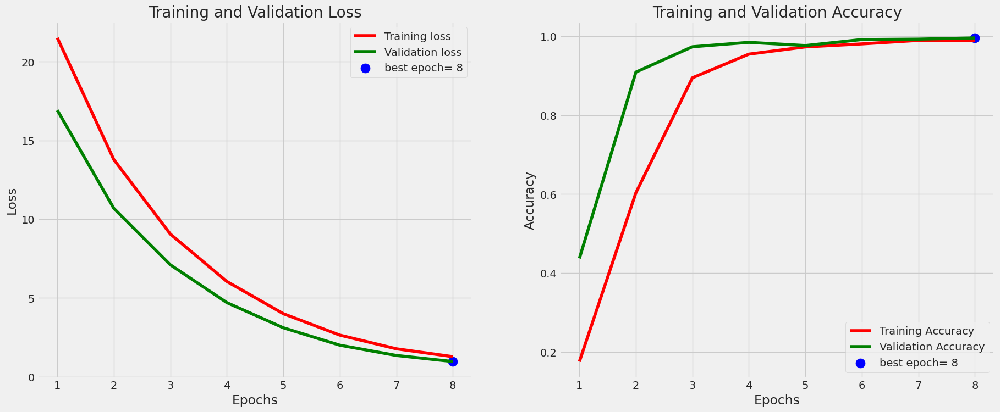
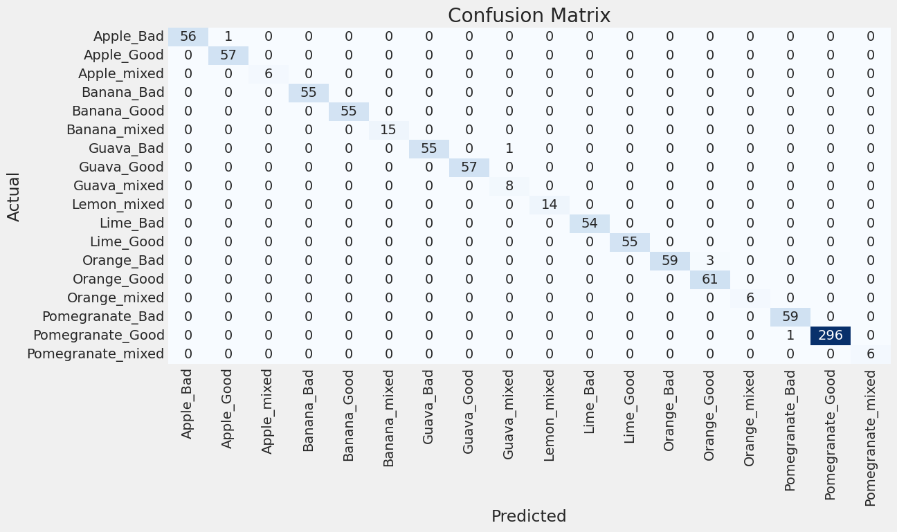

# Fruit Quality Detection
- It is an Android-based application that leverages the power of Deep Learning Models to accurately identify the quality of various fruits. It offers a user-friendly interface for assessing the quality of six different types of fruits:
	- Apple
	- Banana
	- Guava
	- Lime
	- Orange
	- Pomegranate
- Fruits are classified into 3 categories:
	- Good
	- Bad
	- Mixed

- The Android app is developed using the Java. It is designed for devices running Android 8.0 or later, including the latest Android 12. The core of the application relies on an advanced Deep Learning model known as EfficientNetB5, renowned for its exceptional performance in image classification tasks.

## Demo
https://github.com/Kunal-Attri/Fruit-Quality-Detection/assets/35298757/ec67660c-16ad-4f2e-b866-67d48165e885

## How to run the application?
1. Ensure that your Android device is running Android 8.0 or higher.
2. Download the [APK file](https://media.githubusercontent.com/media/Kunal-Attri/Fruit-Quality-Detection/main/FQD.apk) provided in the root directory.
3. Install the APK file on your Android phone.
4. Launch the application.
5. Please grant the app two essential permissions: camera permission for capturing images and files permission for accessing images from the gallery.

## Model Training Results
We trained a DNN model with EfficientNet B5 as th base model to classify fruit images into various type. On training, we got the following results.

Training Loss and acuracy across epochs trained: 

  
Confusion Matrix: 

## Results
The Fruit Quality Detection application offers robust and accurate fruit quality detection. It provides users with the ability to classify fruits into three distinct categories: good, bad, or mixed, enabling informed decisions regarding fruit selection and quality assessment. 
   

## Related Files
- Figma Design Link: [Fruit Quality Detection](https://www.figma.com/file/aqndq21uAoHvwE20UXPsql/Ai-Camera-App-(Community)?type=design&node-id=0%3A1&t=WRRVOR0uBZatYwRx-1)
- Dataset Link: [Kaggle](https://www.kaggle.com/datasets/shashwatwork/fruitnet-indian-fruits-dataset-with-quality)
- Colab Model Training Files: [Google Colab](https://colab.research.google.com/drive/1ILmnlWuZe9N5_qfIGSQdfNox-kMOUJsd?usp=sharing) (Request for access)
- If you wish to customize the Android app, all the source files are conveniently located in the 'Android Files Java' folder, available for download as a zip file.

## References
To build this project, we drew upon the expertise and research from the following sources:
1. Aradhana, B., and Raj, A. Quality and pesticides detection in fruits and vegetables.
2. C, S., Manasa, N., Sharma, V., and A., N. K. A. Vegetable classification using you only
look once algorithm. In 2019 International Conference on Cutting-edge Technologies in
Engineering (ICon-CuTE), IEEE, pp. 101–107.
3. Duth, P. S., and Shashidhara, B. S. Banana grading using deep learning techniques. In
2022 IEEE International Conference on Data Science and Information System (ICDSIS)
(jul 2022), IEEE, pp. 1–5.
4. Jeong, H.-J., Park, K.-S., and Ha, Y.-G. Image preprocessing for efficient training of YOLO
deep learning networks. In 2018 IEEE International Conference on Big Data and Smart
Computing (BigComp) (jan 2018), IEEE, pp. 635–637.
5. Liu, G., Nouaze, J. C., Mbouembe, P. L. T., and Kim, J. H. YOLO-tomato: A robust algorithm
for tomato detection based on YOLOv3. 2145.
6. Yogesh, Dubey, A. K., Vyas, T., and Thukral, M. Segmentation techniques for ex-
ternal defect detection in pome fruits. In 2017 6th International Conference on Reliability,
Infocom Technologies and Optimization (Trends and Future Directions) (ICRITO), IEEE,
pp. 615–618.

Feel free to explore these references for further information and insights into the technologis used in Fruit Quality Detection project.
