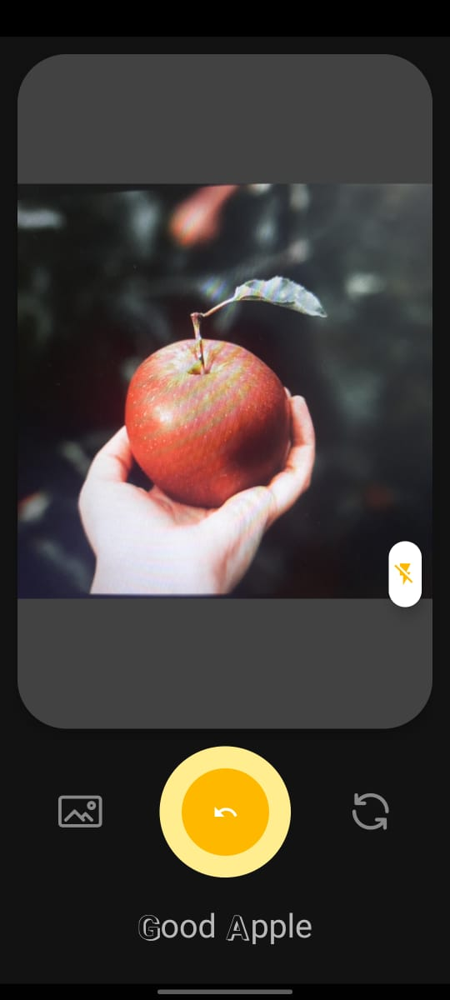
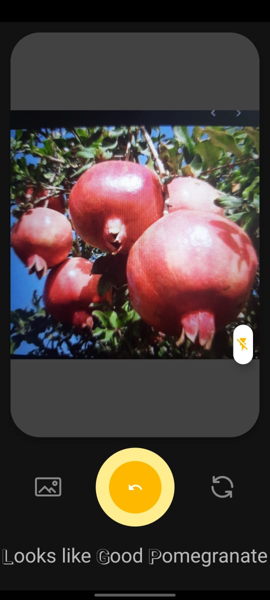
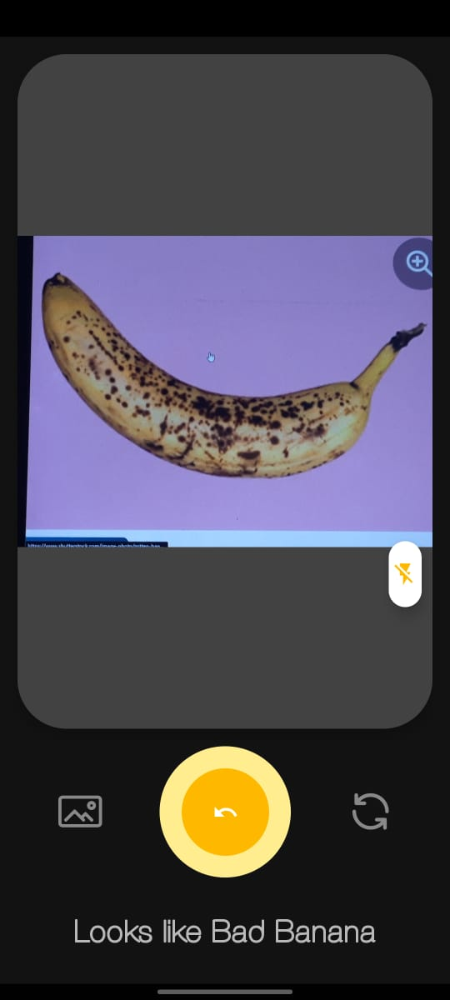
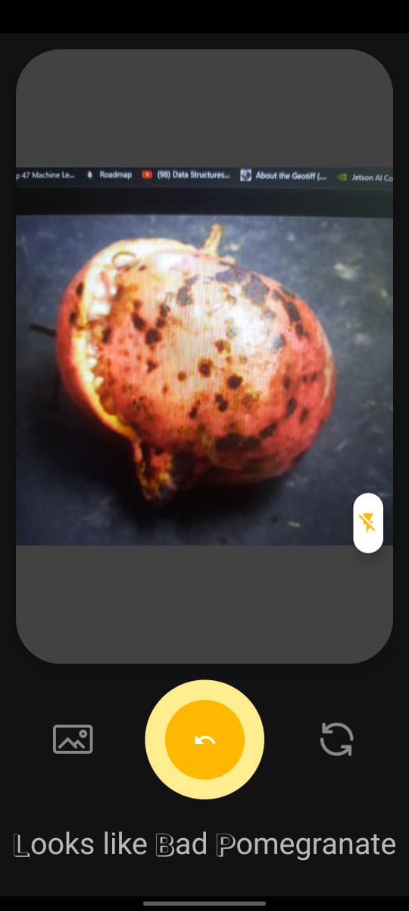

# Fruit Quality Detection
- It is a Android based project which used a Deep Learning Model to identify the quality of various fruits.
- It can detect quality of 6 fruits:
	- Apple
	- Banana
	- Guava
	- Lime
	- Orange
	- Pomegranate
- It can classify the fruits into 3 categories:
	- Good
	- Bad
	- Mixed
- Android app is made using Java language targeted for devices upto Android 12.
- We have trained a Deep Learning model based on EfficientNetB5 which is a very good model in itself to classify images.

## How to run the application?
- You only need a android device running Android 8.0 or later.
- Install the [APK file](https://media.githubusercontent.com/media/Kunal-Attri/Fruit-Quality-Detection/main/FQD.apk) given in the root directory.
- App needs 2 permissions - Camera permission to take images and Files permission to read images from gallery.

## Related Files
- Figma Design Link: [Fruit Quality Detection](https://www.figma.com/file/aqndq21uAoHvwE20UXPsql/Ai-Camera-App-(Community)?type=design&node-id=0%3A1&t=WRRVOR0uBZatYwRx-1)
- Dataset Link: [Kaggle](https://www.kaggle.com/datasets/shashwatwork/fruitnet-indian-fruits-dataset-with-quality)
- Colab Model Training Files: [Google Colab](https://colab.research.google.com/drive/1ILmnlWuZe9N5_qfIGSQdfNox-kMOUJsd?usp=sharing) (Request for access)
- You can customize Android App. All of tis source files are under the folder 'Android Files Java'

## Result
   

## References
- Aradhana, B., and Raj, A. Quality and pesticides detection in fruits and vegetables.
- C, S., Manasa, N., Sharma, V., and A., N. K. A. Vegetable classification using you only
look once algorithm. In 2019 International Conference on Cutting-edge Technologies in
Engineering (ICon-CuTE), IEEE, pp. 101–107.
- Duth, P. S., and Shashidhara, B. S. Banana grading using deep learning techniques. In
2022 IEEE International Conference on Data Science and Information System (ICDSIS)
(jul 2022), IEEE, pp. 1–5.
- Jeong, H.-J., Park, K.-S., and Ha, Y.-G. Image preprocessing for efficient training of YOLO
deep learning networks. In 2018 IEEE International Conference on Big Data and Smart
Computing (BigComp) (jan 2018), IEEE, pp. 635–637.
- Liu, G., Nouaze, J. C., Mbouembe, P. L. T., and Kim, J. H. YOLO-tomato: A robust algorithm
for tomato detection based on YOLOv3. 2145.
- Yogesh, Dubey, A. K., Vyas, T., and Thukral, M. Segmentation techniques for ex-
ternal defect detection in pome fruits. In 2017 6th International Conference on Reliability,
Infocom Technologies and Optimization (Trends and Future Directions) (ICRITO), IEEE,
pp. 615–618.
